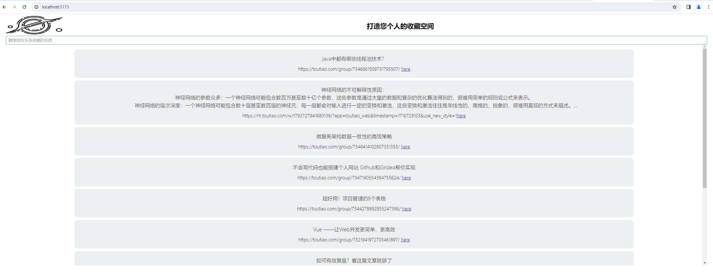

# my-search

This template should help get you started developing with Vue 3 in Vite.

## Recommended IDE Setup

[VSCode](https://code.visualstudio.com/) + [Volar](https://marketplace.visualstudio.com/items?itemName=Vue.volar) (and disable Vetur) + [TypeScript Vue Plugin (Volar)](https://marketplace.visualstudio.com/items?itemName=Vue.vscode-typescript-vue-plugin).

## Customize configuration

See [Vite Configuration Reference](https://vitejs.dev/config/).

## Project Setup

```sh
npm install
```

### Compile and Hot-Reload for Development

```sh
npm run dev
```

### Compile and Minify for Production

```sh
npm run build
```

# backgroud
收藏很多文章到今日头条，自带的搜索功能连个关键字都搜索不出来，只能自己去翻阅。自己用python定时爬取自己我的收藏到ES（参考https://gitee.com/pmh905001/myfavorite 或者 https://github.com/pmh905001/myfavorite）前端用vue3展现并且可以搜索。
- 